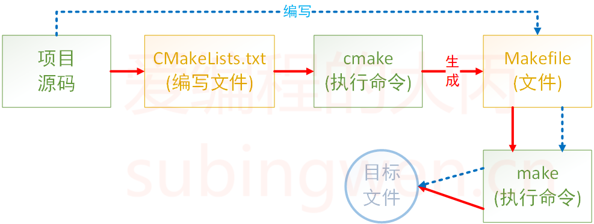

# 1. git 操作过程

**可以看出分为四部分**
1. 作区（Working Directory）:

+ 工作区是你的项目目录，其中包含了所有你正在工作的文件。这是你编写代码、修改文件的地方。
+ 在文件系统中，工作区就是你的项目文件夹。

2. 暂存区（Staging Area）:

+ 暂存区是一个索引（index），它位于工作区和本地仓库之间。当你使用 git add 命令时，更改的文件会被放入暂存区，准备下一次提交。
+ 暂存区不是一个实际的目录，而是一个 Git 用来跟踪即将被提交的更改的内部结构。

3. 本地仓库（Local Repository）:

+ 本地仓库是 Git 用来保存你的项目历史记录的地方。它包含了所有的提交(commits)、分支(branches)、标签(tags)等。
+ 在文件系统中，本地仓库通常位于工作区的 .git 目录中。当你首次运行 git init 时，这个目录会被创建。

## git 内容

+ 将本地项目上传至Git

+ 将Git项目下载到本地

+ 双向之间的更新

## git 命令
 

